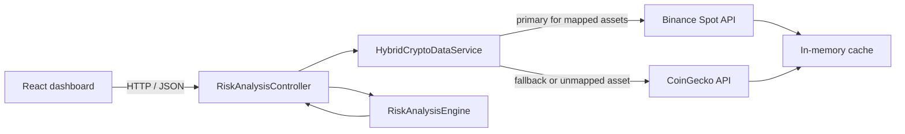

# Crypto Risk Analysis

[](https://dotnet.microsoft.com/)
[](https://react.dev/)
[](https://www.typescriptlang.org/)
[](https://github.com/maykk159/CryptoRiskAnalysis/actions/workflows/ci.yml)

Crypto Risk Analysis is a full-stack dashboard for exploring the market risk of cryptocurrency assets. It combines completed daily candles from Binance and CoinGecko with a local risk engine that calculates volatility, momentum, volume, drawdown, Sharpe ratio, downside risk, and historical Value at Risk.

The project is built as a .NET 10 Web API with a React 19 and TypeScript client. It uses public market-data endpoints and does not require API keys for local development.

> [!IMPORTANT]
> This project is an analytical and educational tool. Its scores are model outputs based on historical market data, not investment advice or predictions of future performance.

## Features

- **Hybrid market data:** Binance is used first for mapped assets; CoinGecko supports fallback and assets outside the Binance map.
- **Consistent daily observations:** Both providers return completed daily data, avoiding partial intraday candles in historical calculations.
- **Selectable analysis periods:** 7, 30, and 90 days.
- **Risk dashboard:** Composite risk, volatility, trend, and volume scores on a 0–100 scale.
- **Advanced metrics:** Annualized volatility, downside risk, maximum drawdown, annualized Sharpe ratio, and daily historical VaR at 95% confidence.
- **Resilient provider access:** Exponential retries, timeouts, circuit breakers, cancellation propagation, and typed upstream errors.
- **Efficient requests:** In-memory provider caches and a single combined market-data request per analysis.
- **API protection:** Per-IP fixed-window rate limiting with 30 requests per minute.
- **Structured diagnostics:** Console and rolling file logs through Serilog.

## Architecture



The API follows a layered structure:

- **Controller:** validates the requested period, coordinates market data and returns a consistent response envelope.
- **Hybrid data service:** selects Binance or CoinGecko and falls back only for expected provider failures.
- **Provider services:** fetch, validate, normalize, and cache daily price and volume data.
- **Risk engine:** performs all calculations locally after market data has been retrieved.
- **Middleware:** maps provider and application exceptions to appropriate HTTP responses.

### Provider behavior

| Capability | Binance | CoinGecko |
|---|---|---|
| Role | Primary for mapped assets | Fallback and long-tail assets |
| Market data | Daily USDT klines | Daily USD market chart |
| Cache duration | 60 seconds | 180 seconds |
| Authentication | Not required | Not required |

Transient network errors, upstream `5xx` responses, and `429` responses are retried up to three times with exponential delays. A provider circuit opens for 30 seconds after five handled failures, and each provider request has a 10-second policy timeout.

## Technology stack

| Area | Technologies |
|---|---|
| Backend | .NET 10, ASP.NET Core Web API, C# |
| Resilience and logging | Polly, ASP.NET Core rate limiting, Serilog |
| API documentation | Swagger / OpenAPI |
| Frontend | React 19, TypeScript 5.9, Vite 7 |
| UI and charts | Tailwind CSS, Recharts, Lucide React |
| Server-state management | TanStack Query |
| Tests | xUnit, Moq, Vitest |

## Getting started

### Prerequisites

- [.NET 10 SDK](https://dotnet.microsoft.com/download/dotnet/10.0)
- [Node.js](https://nodejs.org/) 20.19+ or 22.12+ (required by Vite 7)
- [Git](https://git-scm.com/)

### 1. Clone the repository

```bash
git clone https://github.com/maykk159/CryptoRiskAnalysis.git
cd CryptoRiskAnalysis
```

### 2. Restore dependencies

```bash
dotnet restore CryptoRiskAnalysis.API.sln
cd client
npm install
cd ..
```

On Windows, `setup.ps1` performs the same dependency setup:

```powershell
.\setup.ps1
```

### 3. Start the API

From the repository root, move into the API project directory:

```bash
cd CryptoRiskAnalysis.API
dotnet run
```

Press `Ctrl+C` to stop the API. Because the terminal remains in the API directory, you can start it again with just `dotnet run`.

The development API listens on `http://localhost:5058`. Swagger UI is available at [http://localhost:5058/swagger](http://localhost:5058/swagger).

### 4. Start the client

Open a second terminal:

```bash
cd client
npm run dev
```

Open [http://localhost:5173](http://localhost:5173). The API CORS policy accepts the local Vite origins on ports `5173` and `5174`.

## Configuration

The client uses `http://localhost:5058/api` by default. To point it to another API deployment, create `client/.env.local`:

```dotenv
VITE_API_URL=https://api.example.com/api
```

Environment files are ignored by Git. Do not commit credentials or deployment secrets.

## API reference

### Get a risk analysis

```http
GET /api/RiskAnalysis/{assetId}?days={7|30|90}
```

`days` defaults to `30`. The `assetId` uses the CoinGecko identifier format, such as `bitcoin`, `ethereum`, or `polygon-ecosystem-token`.

Example request:

```bash
curl "http://localhost:5058/api/RiskAnalysis/bitcoin?days=30"
```

Example response:

```json
{
  "succeeded": true,
  "message": null,
  "data": {
    "assetId": "bitcoin",
    "compositeRiskScore": 31.42,
    "volatilityScore": 38.17,
    "trendScore": 24.86,
    "volumeScore": 29.35,
    "downsideRisk": 42.68,
    "maxDrawdown": 12.71,
    "sharpeRatio": 0.84,
    "valueAtRisk95": 4.12,
    "annualizedVolatility": 61.73,
    "priceHistory": [
      {
        "timestamp": 1756684800000,
        "price": 108245.37
      }
    ]
  },
  "errors": null
}
```

The numeric values above illustrate the response shape; live results depend on the selected asset, period, provider, and request time.

### HTTP responses

| Status | Meaning |
|---|---|
| `200` | Analysis completed successfully |
| `400` | Unsupported `days` value |
| `404` | Asset or market data was not found |
| `429` | Application or upstream provider rate limit was reached |
| `502` | Market-data provider returned an invalid or unsuccessful response |
| `503` | Provider circuit breaker is open |
| `504` | Market-data request timed out |
| `500` | Unexpected application error |

Errors use the same response envelope with `succeeded: false`. Production responses hide internal exception details.

## Risk methodology

Daily log returns are calculated as:

```text
r(t) = ln(P(t) / P(t-1))
```

| Metric | Implementation |
|---|---|
| Annualized volatility | Sample standard deviation of daily log returns multiplied by `sqrt(365)` |
| Downside risk | Root mean square of returns below a 0% daily target, annualized with `sqrt(365)` |
| Maximum drawdown | Largest observed peak-to-trough percentage decline |
| Sharpe ratio | Mean daily log return divided by sample standard deviation, using a 0% risk-free rate and annualized with `sqrt(365)` |
| Historical VaR 95% | Daily loss at the 5th percentile; for fewer than 20 returns, the worst observed return is used |
| Trend score | Absolute difference between the recent price average and the full selected-period average |
| Volume score | Current-to-average volume ratio interpreted alongside the recent price change |

The composite risk score is a bounded 0–100 application score. It starts with volatility, trend, and volume weights of 40%, 30%, and 30%, then adjusts the weights when one component is elevated. Concurrent high-risk signals amplify the result; uniformly low signals reduce it. This score is a project-specific heuristic and should be validated for any production or financial use case.

## Supported dashboard assets

The current UI exposes 20 assets:

Bitcoin, Ethereum, BNB, Solana, XRP, Dogecoin, Toncoin, Cardano, Shiba Inu, Avalanche, TRON, Polkadot, Bitcoin Cash, Chainlink, Polygon (POL), NEAR Protocol, Internet Computer, Litecoin, Uniswap, and Aptos.

The API also accepts other valid CoinGecko asset IDs. Assets without a Binance mapping are requested directly from CoinGecko.

## Testing and quality checks

Run the backend test suite:

```bash
dotnet test
```

Validate the frontend:

```bash
cd client
npm run lint
npm test
npm run build
```

The backend suite covers controller behavior, cancellation propagation, the risk engine, Binance and CoinGecko validation, caching and concurrent-request deduplication, provider errors, hybrid fallback, retry/timeout/circuit behavior, exception middleware, and the rate-limit JSON response. Frontend tests cover low-price formatting and user-facing network errors.

GitHub Actions runs the backend warning-as-error build and test suite plus the frontend install, lint, test, and production build on every push and pull request.

## Project structure

```text
CryptoRiskAnalysis/
├── CryptoRiskAnalysis.API/       ASP.NET Core API
│   ├── Controllers/              HTTP endpoints
│   ├── DTOs/                     API response models
│   ├── Exceptions/               Typed market-data failures
│   ├── Extensions/               DI, resilience, CORS, and rate-limit setup
│   ├── Middleware/               Global exception handling
│   ├── Models/                   Price and risk domain models
│   └── Services/                 Providers, routing, and risk calculations
├── CryptoRiskAnalysis.Tests/     xUnit backend tests
├── .github/workflows/ci.yml      Backend and frontend CI
├── client/                       React and TypeScript application
│   └── src/
│       ├── components/           Dashboard and chart components
│       ├── constants/            Supported asset catalog
│       ├── hooks/                Shared React hooks
│       ├── services/             API client
│       └── types/                TypeScript contracts
├── CryptoRiskAnalysis.API.sln
└── setup.ps1
```

## Production considerations

Local development intentionally uses HTTP and permits the local Vite origins. Before deploying publicly:

- configure a Kestrel HTTPS certificate or terminate TLS at a trusted reverse proxy (production HTTP requests are redirected to HTTPS port 443);
- replace the local CORS origins with the deployed frontend origin;
- run with `ASPNETCORE_ENVIRONMENT=Production` so internal exception details are hidden;
- review rate limits and caching for the expected traffic profile;
- add authentication if the API should not be public;
- monitor provider terms, availability, and rate-limit policies.

## Author

**Enes Camkaya** — [@maykk159](https://github.com/maykk159)

Project repository: [github.com/maykk159/CryptoRiskAnalysis](https://github.com/maykk159/CryptoRiskAnalysis)
